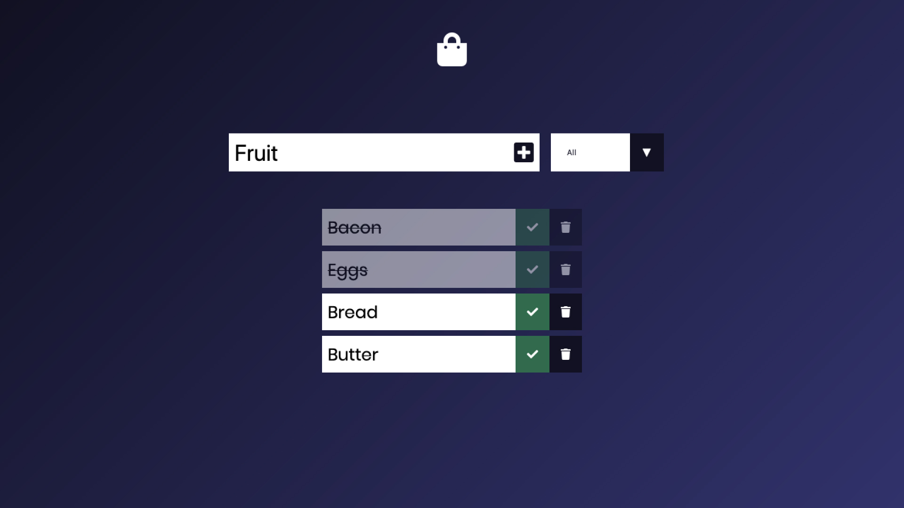

# Grocery List

Grocery list is a todo list web app that allows you to add list items, cross out items, and delete items. You are also able to filter said items by their completion status. Local storage keeps the items on the list in case the browser is closed.

Created with HTML, CSS, and Vanilla JavaScript

